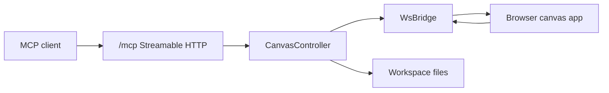

# Architecture

Agentic Canvas runs as one local Node process. Express serves the built browser app and mounts an MCP Streamable HTTP endpoint at `/mcp`. A WebSocket endpoint at `/ws` keeps the browser and the server-authoritative scene synchronized.

The canonical scene is plugin-native data plus app state held by `CanvasController`. MCP tools mutate the scene through the active `CanvasPlugin`; browser edits replace the scene through the WebSocket bridge. Save/open/screenshot file writes go through `Workspace`, which rejects paths outside the configured root.

Some baseline tools need live browser state. `screenshot`, `get_selected_objects`,
and `select_objects` send correlated WebSocket requests to the most recently synced
browser client and return clear MCP errors when no browser is connected or the
browser does not respond. Read selection is queried on demand from the browser UI
state, then resolved against the server-authoritative scene before MCP clients
receive normalized objects. Write selection sends server-resolved ids back to the
browser without making selection part of the authoritative scene.

The Node side never imports `@excalidraw/excalidraw`. Runtime Excalidraw APIs are isolated to `src/web`.

## Plugin Model

Canvas plugins are internal and statically wired. The shipped runtime plugins are
`excalidraw` and `jsoncanvas`; there is no dynamic plugin loader, runtime plugin
marketplace, or remote registry.

Every plugin implements the `CanvasPlugin` contract, owns the native scene format,
maps native objects to normalized `CanvasObject` values for baseline MCP tools,
advertises capabilities for MCP clients, and may register additional
engine-specific tools. Baseline tools are registered before plugin-specific tools.

For implementation guidance, see [Plugin Authoring Guide](./plugins.md). For exact
interfaces and tool registration rules, see
[Plugin API Reference](./plugin-api-reference.md).
