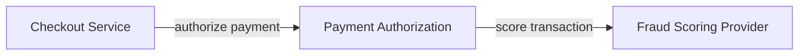

# Agentic Canvas — Flow Plugin Specification

**Canvas name:** `flow`
**Target project:** `@trohde/agentic-canvas`
**Status:** Updated implementation specification
**Updated:** 2026-06-15
**Primary outcome:** Add a strict, typed graph/workflow canvas that builds on the plugin-neutral normalization already introduced for `jsoncanvas`.

---

## 1. Executive summary

The `flow` plugin adds a typed node/edge graph canvas to Agentic Canvas. It is intended for architecture maps, application dependency graphs, workflow models, data lineage, integration flows, control/risk flows, and other structured diagrams where the graph itself is the primary artifact.

The previous Flow spec assumed that Agentic Canvas still needed a plugin-neutral core refactor. That is no longer the case. JSON Canvas has already introduced the normalization work that Flow needs: generic scenes, generic normalized summaries/details, plugin capabilities, registry-based plugin selection, plugin-specific file extensions, browser scene normalization, and React Flow rendering through `@xyflow/react`.

The Flow implementation should therefore be incremental:

1. add a Flow-native document model;
2. add validation, adapter, serialization, and graph algorithms;
3. add Flow-specific MCP tools;
4. add a React Flow browser renderer by reusing the JSON Canvas WebSocket/rendering pattern;
5. register `flow` in the plugin registry and browser app switch.

Do **not** rework the core unless a small compatibility issue is unavoidable.

---

## 2. What changed because JSON Canvas is now implemented

### 2.1 Plugin-neutral core is already done

Flow should consume the current generic `Scene<TNative, TAppState>` model:

```ts
export interface Scene<TNative = unknown, TAppState = Record<string, unknown>> {
  native: TNative;
  appState: TAppState;
  version: number;
}
```

For Flow:

```ts
export type FlowScene = Scene<FlowDocument, FlowAppState>;
```

### 2.2 Flow should use `CanvasObjectSummary` / `CanvasObjectDetail`, not shape objects

Flow should map plugin-native graph items into normalized objects with `type`, `pluginType`, `kind`, optional geometry, `label`, `text`, `raw`, and `references`.

Flow should **not** implement `createObject` or `updateObject` in the `CanvasPlugin` object. Those are still shape-oriented compatibility hooks for Excalidraw. Flow should expose Flow-specific tools such as `add_flow_node`, `connect_flow_nodes`, and `apply_flow_patch`.

### 2.3 Generic shape tools should not be registered for Flow

The MCP server now registers generic shape tools only when a plugin provides both `createObject` and `updateObject`. Flow should omit both so agents do not get misleading tools like `create_object` or `apply_canvas_patch` for a typed graph canvas.

### 2.4 `get_canvas_capabilities` is now a first-class baseline tool

Flow must implement `getCapabilities()` so agents can discover the correct Flow-specific tool surface and avoid generic shape assumptions.

### 2.5 `@xyflow/react` is already present

JSON Canvas already added `@xyflow/react`. Flow should use the same package. No new browser canvas dependency is needed for the MVP.

### 2.6 React Flow rendering pattern already exists

JSON Canvas already has a React Flow based browser canvas that:

- receives `scene:set` messages;
- maps native document nodes/edges to React Flow nodes/edges;
- applies browser node/edge changes;
- sends `scene:changed` with the plugin-native document;
- handles selection request/selection set;
- handles screenshot export.

Flow should copy this pattern first. Extract shared React Flow helpers only after Flow works and duplication becomes obvious.

### 2.7 File extension decision updated

The original spec proposed `.flow.json`. The current baseline save/open path helper checks extensions with `nodePath.extname`, which handles simple extensions such as `.excalidraw` and `.canvas` cleanly, but treats `demo.flow.json` as having extension `.json`.

To avoid a core change, the MVP should use:

```ts
export const FLOW_EXTENSION = ".flow";
```

The file content remains plain JSON.

If `.flow.json` is required later, first update the baseline path helper to allow compound suffixes by checking `path.toLowerCase().endsWith(expectedExtension)` instead of relying only on `nodePath.extname`.

---

## 3. Product goal

Add a strict graph canvas that lets agents create, edit, validate, and reason over explicit models.

Typical use cases:

- system architecture maps;
- service dependency diagrams;
- application integration flows;
- data lineage;
- event-driven architecture maps;
- workflow and process models;
- control/risk relationship maps;
- capability-to-system mappings;
- target-state migration plans;
- incident blast-radius analysis.

Example prompt the plugin should support:

> “Create a flow map of the payment authorization path, identify upstream dependencies, and flag cycle or single-point-of-failure risks.”

Expected result: a typed graph with systems, queues, databases, external parties, ports, labeled edges, validation findings, and a layout that a human can inspect.

---

## 4. Positioning against existing canvases

| Concern | Excalidraw | JSON Canvas | Flow |
|---|---|---|---|
| Primary mode | Visual sketching | Portable knowledge cards | Strict typed graph model |
| Main objects | Shapes, text, arrows, frames | Text/file/link/group cards, edges | Typed nodes, ports, typed edges |
| Best for | Communicating visually | Research and knowledge mapping | Architecture/workflow reasoning |
| File extension | `.excalidraw` | `.canvas` | `.flow` |
| Validation | Low | Medium | High |
| Agent reasoning | Visual-object level | Semantic-card level | Graph-query level |

Use `flow` when the structure matters more than the drawing.

---

## 5. Design principles

### 5.1 Graph-first, not drawing-first

Every visual element should have graph semantics. A node is a node. An edge is a relationship. Ports are explicit connection points. Metadata is inert but first-class.

Do not model important semantics as freeform labels inside visual shapes.

### 5.2 Validation over permissiveness

The plugin should reject invalid graph states where possible and report loaded-file issues clearly.

Examples:

- edge points to missing node;
- edge points to missing port;
- duplicate ID;
- unsupported node type;
- relationship type not allowed between source and target types;
- graph declared acyclic but contains a cycle.

### 5.3 Stable file format

Use an Agentic Canvas-owned JSON file format. React Flow is the browser renderer, not the durable persistence contract.

### 5.4 Agent-friendly operations

Prioritize graph-level MCP tools:

- add node;
- add port;
- connect nodes;
- find upstream/downstream;
- find path;
- find cycles;
- validate;
- layout;
- bulk patch.

Avoid forcing agents to manipulate pixel geometry except for explicit layout requests.

---

## 6. Non-goals for MVP

The MVP must not include:

- BPMN compliance;
- ArchiMate compliance;
- C4 model enforcement;
- UML import/export;
- Mermaid import parser;
- graph database storage;
- live runtime monitoring;
- cloud collaboration;
- simulation engine;
- executable workflows;
- code generation;
- multi-user CRDT editing;
- policy engine integration.

These can be future features. The MVP should stay a local-first typed graph editor controlled by MCP.

---

## 7. Current codebase baseline to use

This spec assumes the current post-JSON-Canvas architecture.

### 7.1 Core scene model

Flow should use:

```ts
Scene<FlowDocument, FlowAppState>
```

The plugin-native document lives in `scene.native`. Runtime UI state lives in `scene.appState`. The controller manages the authoritative version number.

### 7.2 Plugin contract

Flow implements `CanvasPlugin`:

```ts
export function createFlowPlugin(): CanvasPlugin {
  return {
    name: "flow",
    fileExtension: FLOW_EXTENSION,
    createInitialScene,
    getCapabilities,
    getMetadata,
    listObjects,
    getObject,
    deleteObjects,
    clear,
    normalizeBrowserScene,
    serialize,
    deserialize,
    registerTools,
  };
}
```

Deliberately omit:

```ts
createObject
updateObject
```

That prevents shape-only tools from being advertised for Flow.

### 7.3 Registry integration

Add Flow to the existing static registry:

```ts
export const canvasPlugins = {
  excalidraw: createExcalidrawPlugin,
  jsoncanvas: createJsonCanvasPlugin,
  flow: createFlowPlugin,
} satisfies Record<string, () => CanvasPlugin>;
```

No new CLI parsing design is needed. The current CLI reads the registry and validates `--canvas` against available names.

### 7.4 Browser integration

Add Flow to the existing browser renderer switch:

```tsx
if (canvasInfo.canvas === "jsoncanvas") {
  return <JsonCanvasApp mcpUrl={canvasInfo.mcpUrl} />;
}

if (canvasInfo.canvas === "flow") {
  return <FlowCanvasApp mcpUrl={canvasInfo.mcpUrl} />;
}

return <CanvasApp />;
```

Longer term, rename `CanvasApp` to `ExcalidrawCanvasApp` for clarity, but do not block Flow on that rename.

---

## 8. File and directory layout

```text
src/plugins/flow/
  index.ts              # CanvasPlugin implementation
  model.ts              # Flow document types
  schemas.ts            # Zod schemas for file format and MCP inputs
  format.ts             # serialize/deserialize .flow JSON
  adapter.ts            # Flow graph <-> CanvasObjectSummary/Detail
  tools.ts              # Flow-specific MCP tools
  graph.ts              # graph traversal algorithms
  validation.ts         # graph validation and optional repair
  layout.ts             # deterministic layout
  mermaid.ts            # export Mermaid flowchart text
  defaults.ts           # node/edge defaults and type priorities

src/web/canvases/flow/
  FlowCanvasApp.tsx     # React Flow renderer + WS integration
  mapping.ts            # FlowDocument <-> React Flow nodes/edges
  exportImage.ts        # simple semantic PNG export
  nodes/
    FlowNodeCard.tsx
    BoundaryNode.tsx
  edges/
    TypedEdge.tsx
  inspector/
    FlowInspector.tsx

tests/flow/
  flow-format.test.ts
  flow-validation.test.ts
  flow-adapter.test.ts
  flow-graph.test.ts
  flow-layout.test.ts
  flow-tools.test.ts
  flow-mermaid.test.ts
  flow-ws-roundtrip.test.ts
```

Optional later extraction, only after Flow is working:

```text
src/web/canvases/reactflow/
  useCanvasWsScene.ts
  selection.ts
  pngExport.ts
```

Do not prematurely generalize JSON Canvas and Flow rendering. They share React Flow mechanics but have different file formats and semantics.

---

## 9. Dependencies

### 9.1 Required dependency

No new dependency is required for the MVP because `@xyflow/react` is already present.

Flow should import:

```ts
import {
  Background,
  Controls,
  MiniMap,
  ReactFlow,
  ReactFlowProvider,
  addEdge,
  applyEdgeChanges,
  applyNodeChanges,
} from "@xyflow/react";
import "@xyflow/react/dist/style.css";
```

### 9.2 Do not add layout libraries in MVP

Do not add these unless the deterministic TypeScript layout proves insufficient:

- `elkjs`;
- `dagre`;
- Mermaid parser packages.

MVP layout should be deterministic TypeScript.

---

## 10. File format

Use `.flow` in the MVP.

The file is still plain JSON. The extension is chosen to fit the current plugin `fileExtension` handling without changing baseline save/open logic.

### 10.1 Top-level document

```ts
export interface FlowDocument {
  type: "agentic-flow";
  version: 1;
  nodes: FlowNode[];
  edges: FlowEdge[];
  settings?: FlowSettings;
}
```

### 10.2 Settings

```ts
export interface FlowSettings {
  direction?: "LR" | "TB";
  acyclic?: boolean;
  domain?: "architecture" | "workflow" | "data-lineage" | "risk-control" | "generic";
  allowedNodeTypes?: FlowNodeType[];
  allowedEdgeTypes?: FlowEdgeType[];
  strictValidation?: boolean;
}
```

### 10.3 Example `.flow`

```json
{
  "type": "agentic-flow",
  "version": 1,
  "settings": {
    "direction": "LR",
    "acyclic": true,
    "domain": "architecture"
  },
  "nodes": [
    {
      "id": "node_checkout",
      "type": "service",
      "label": "Checkout Service",
      "description": "Starts the payment authorization flow.",
      "x": 0,
      "y": 0,
      "status": "active",
      "ports": [
        {
          "id": "out_auth",
          "label": "authorize",
          "direction": "out",
          "side": "right",
          "protocol": "HTTPS"
        }
      ]
    },
    {
      "id": "node_auth",
      "type": "service",
      "label": "Payment Authorization",
      "x": 360,
      "y": 0,
      "status": "active",
      "ports": [
        {
          "id": "in_auth",
          "direction": "in",
          "side": "left",
          "protocol": "HTTPS"
        },
        {
          "id": "out_fraud",
          "direction": "out",
          "side": "right",
          "protocol": "HTTPS"
        }
      ]
    },
    {
      "id": "node_fraud",
      "type": "external",
      "label": "Fraud Scoring Provider",
      "x": 720,
      "y": 0,
      "status": "at-risk"
    }
  ],
  "edges": [
    {
      "id": "edge_checkout_auth",
      "type": "calls",
      "source": "node_checkout",
      "sourcePort": "out_auth",
      "target": "node_auth",
      "targetPort": "in_auth",
      "label": "authorize payment"
    },
    {
      "id": "edge_auth_fraud",
      "type": "calls",
      "source": "node_auth",
      "sourcePort": "out_fraud",
      "target": "node_fraud",
      "label": "score transaction"
    }
  ]
}
```

---

## 11. Native graph model

### 11.1 Document types

```ts
export type FlowDirection = "LR" | "TB";

export interface FlowDocument {
  type: "agentic-flow";
  version: 1;
  nodes: FlowNode[];
  edges: FlowEdge[];
  settings?: FlowSettings;
}

export interface FlowSettings {
  direction?: FlowDirection;
  acyclic?: boolean;
  domain?: "architecture" | "workflow" | "data-lineage" | "risk-control" | "generic";
  allowedNodeTypes?: FlowNodeType[];
  allowedEdgeTypes?: FlowEdgeType[];
  strictValidation?: boolean;
}
```

### 11.2 Node model

```ts
export type FlowNodeType =
  | "system"
  | "service"
  | "database"
  | "queue"
  | "topic"
  | "external"
  | "actor"
  | "process"
  | "decision"
  | "control"
  | "risk"
  | "boundary"
  | "note"
  | "generic";

export type FlowNodeStatus =
  | "unknown"
  | "proposed"
  | "active"
  | "deprecated"
  | "retired"
  | "at-risk";

export interface FlowNode {
  id: string;
  type: FlowNodeType;
  label: string;
  description?: string;
  x: number;
  y: number;
  width?: number;
  height?: number;
  status?: FlowNodeStatus;
  owner?: string;
  system?: string;
  tags?: string[];
  ports?: FlowPort[];
  parentId?: string;
  metadata?: Record<string, unknown>;
}
```

### 11.3 Port model

```ts
export type FlowPortDirection = "in" | "out" | "both";
export type FlowPortSide = "top" | "right" | "bottom" | "left";

export interface FlowPort {
  id: string;
  label?: string;
  direction: FlowPortDirection;
  side: FlowPortSide;
  protocol?: string;
  dataType?: string;
  required?: boolean;
  metadata?: Record<string, unknown>;
}
```

### 11.4 Edge model

```ts
export type FlowEdgeType =
  | "depends_on"
  | "calls"
  | "publishes"
  | "subscribes"
  | "reads"
  | "writes"
  | "sends_to"
  | "receives_from"
  | "contains"
  | "controls"
  | "mitigates"
  | "causes"
  | "sequence"
  | "fallback"
  | "generic";

export type FlowEdgeStatus = "unknown" | "proposed" | "active" | "deprecated";

export interface FlowEdge {
  id: string;
  type: FlowEdgeType;
  source: string;
  target: string;
  sourcePort?: string;
  targetPort?: string;
  label?: string;
  description?: string;
  status?: FlowEdgeStatus;
  direction?: "directed" | "bidirectional";
  tags?: string[];
  metadata?: Record<string, unknown>;
}
```

### 11.5 Runtime app state

Do not write volatile UI state into `.flow`. Store it in `Scene.appState` only.

```ts
export interface FlowAppState {
  viewport?: {
    x: number;
    y: number;
    zoom: number;
  };
  selectedIds?: string[];
  lastSavedPath?: string;
  inspectorOpen?: boolean;
}
```

---

## 12. Defaults and ID strategy

### 12.1 File extension

```ts
export const FLOW_EXTENSION = ".flow";
```

### 12.2 Default node sizes

```ts
export const FLOW_NODE_DEFAULTS: Record<FlowNodeType, { width: number; height: number }> = {
  system: { width: 240, height: 110 },
  service: { width: 220, height: 90 },
  database: { width: 200, height: 90 },
  queue: { width: 200, height: 80 },
  topic: { width: 200, height: 80 },
  external: { width: 230, height: 100 },
  actor: { width: 180, height: 80 },
  process: { width: 220, height: 90 },
  decision: { width: 190, height: 120 },
  control: { width: 220, height: 90 },
  risk: { width: 220, height: 90 },
  boundary: { width: 560, height: 380 },
  note: { width: 260, height: 140 },
  generic: { width: 220, height: 90 },
};
```

### 12.3 ID generation

```ts
export function createFlowId(prefix: "node" | "edge" | "port"): string {
  return `${prefix}_${crypto.randomUUID().slice(0, 8)}`;
}
```

Rules:

- Preserve IDs across save/open.
- Do not derive IDs from labels.
- Ensure edge IDs are stable and not recalculated from endpoints.
- Port IDs are unique within a node, not globally.
- Reject duplicate node/edge IDs unless repair mode is explicitly requested.

---

## 13. Serialization and file handling

### 13.1 `format.ts`

```ts
export function serializeFlowDocument(document: FlowDocument): string {
  return `${JSON.stringify(sortFlowDocument(document), null, 2)}\n`;
}

export function deserializeFlowDocument(
  raw: string,
  options?: { repair?: boolean },
): { document: FlowDocument; warnings: string[] } {
  const parsed = JSON.parse(raw) as unknown;
  return validateFlowDocument(parsed, options);
}
```

### 13.2 Save behavior

For `--canvas flow`, baseline `save_canvas` appends `.flow` when no extension is provided.

Example input:

```json
{ "path": "payments-authorization" }
```

Expected file:

```text
payments-authorization.flow
```

### 13.3 Open behavior

For `--canvas flow`, baseline `open_canvas` accepts `.flow` only.

Validation steps:

1. parse JSON;
2. validate top-level `type: "agentic-flow"`;
3. validate `version: 1`;
4. validate node and edge arrays;
5. reject duplicate node/edge IDs;
6. reject dangling edges;
7. reject missing ports if an edge references them;
8. validate allowed node/edge/status values;
9. validate dimensions and coordinates;
10. validate parent references and parent cycles;
11. run graph-level validation.

### 13.4 Repair mode

`open_canvas` already accepts `repair?: boolean`. Flow should use it for safe repairs only:

Allowed repair examples:

- remove duplicate edges that are exactly identical;
- remove edges with missing source/target nodes;
- remove port references that point to missing ports if the source/target node exists;
- assign default dimensions when missing;
- normalize empty `nodes` / `edges` to arrays.

Do not repair semantic ambiguity silently:

- do not invent missing nodes;
- do not infer edge type from label;
- do not rename duplicate nodes unless explicitly specified in a future migration tool.

---

## 14. Plugin implementation details

### 14.1 `index.ts`

```ts
export function createFlowPlugin(): CanvasPlugin {
  return {
    name: "flow",
    fileExtension: FLOW_EXTENSION,
    createInitialScene,
    getCapabilities,
    getMetadata,
    listObjects,
    getObject,
    deleteObjects,
    clear,
    normalizeBrowserScene,
    serialize,
    deserialize,
    registerTools,
  };
}
```

### 14.2 Initial scene

```ts
function createInitialScene(): Scene<FlowDocument, FlowAppState> {
  return {
    native: {
      type: "agentic-flow",
      version: 1,
      nodes: [],
      edges: [],
      settings: { direction: "LR", domain: "generic" },
    },
    appState: {},
    version: 0,
  };
}
```

### 14.3 Capabilities

```ts
function getCapabilities(): CanvasPluginCapabilities {
  return {
    pluginTools: [
      "add_flow_node",
      "add_port",
      "update_flow_node",
      "update_port",
      "delete_port",
      "connect_flow_nodes",
      "update_flow_edge",
      "find_flow_nodes",
      "find_flow_edges",
      "find_upstream",
      "find_downstream",
      "find_paths",
      "find_cycles",
      "validate_flow",
      "auto_layout_flow",
      "export_mermaid",
      "apply_flow_patch",
    ],
    destructiveTools: ["delete_object", "delete_port", "clear_canvas", "apply_flow_patch"],
    preferredTools: {
      inspect: [
        "get_canvas_state",
        "get_canvas_capabilities",
        "list_objects",
        "get_object",
        "find_flow_nodes",
        "find_flow_edges",
        "find_upstream",
        "find_downstream",
        "find_paths",
        "find_cycles",
        "validate_flow",
      ],
      create: ["add_flow_node", "add_port", "connect_flow_nodes", "apply_flow_patch"],
      update: ["update_flow_node", "update_port", "update_flow_edge", "apply_flow_patch"],
      connect: ["connect_flow_nodes"],
      layout: ["auto_layout_flow"],
      file: ["save_canvas", "open_canvas", "screenshot", "export_mermaid"],
    },
    usageGuidance: [
      "Use Flow for strict typed graphs where nodes, ports, and edges carry model semantics.",
      "Prefer Flow-specific tools over generic shape tools; this canvas does not expose create_object/update_object.",
      "Use validate_flow before save_canvas when creating architecture, workflow, data-lineage, or risk-control models.",
      "Use apply_flow_patch for multi-node or multi-edge changes that need atomic rollback.",
    ],
  };
}
```

### 14.4 Metadata

```ts
function getMetadata(scene: Scene): CanvasMetadata {
  const document = native(scene);
  return {
    canvas: "flow",
    version: scene.version,
    objectCount: document.nodes.length + document.edges.length,
  };
}
```

Ports are not included in `objectCount` by default. If needed later, add `portCount` to a plugin-specific metadata extension rather than inflating baseline object count.

### 14.5 Browser normalization

```ts
function normalizeBrowserScene(
  incomingNative: unknown,
  appState: unknown,
): { native: FlowDocument; appState: Record<string, unknown> } {
  const result = validateFlowDocument(incomingNative, { repair: false });
  return {
    native: result.document,
    appState: typeof appState === "object" && appState !== null ? appState as Record<string, unknown> : {},
  };
}
```

If validation throws, the existing WebSocket bridge will reject the browser change and re-send the current authoritative server scene. That is the desired behavior for Flow.

### 14.6 Deletion behavior

`deleteObjects(scene, ids)` must support:

- node IDs;
- edge IDs;
- port object IDs if ports are exposed through `list_objects("port")`.

Rules:

- deleting a node deletes all edges touching that node;
- deleting an edge deletes only that edge;
- deleting a port removes the port from its node and deletes or repairs edges referencing that port;
- deleting a boundary node should remove the boundary but keep child nodes by clearing `parentId`, unless a future cascading delete mode is added.

---

## 15. Adapter and normalized object mapping

### 15.1 Summary mapping

Flow should follow the JSON Canvas normalization pattern: return plugin-native objects through `listObjects` and `getObject`, but map them into common `CanvasObjectSummary` / `CanvasObjectDetail` shape.

Recommended mapping:

| Flow item | `type` | `pluginType` | `kind` | Label/text |
|---|---|---|---|---|
| normal node | node type, e.g. `service` | `flow.node.service` | `node` | node label |
| boundary node | `boundary` | `flow.node.boundary` | `group` | boundary label |
| edge | edge type, e.g. `calls` | `flow.edge.calls` | `edge` | edge label or type |
| port | `port` | `flow.port` | `port` | port label or ID |

### 15.2 Filtering rules

`listObjects(scene, type)` should return matches when `type` equals any of:

- `summary.type`;
- `summary.pluginType`;
- `summary.kind`;
- native node type;
- native edge type;
- `port`.

This supports useful calls such as:

```json
{ "type": "node" }
{ "type": "service" }
{ "type": "edge" }
{ "type": "calls" }
{ "type": "port" }
{ "type": "flow.edge.calls" }
```

### 15.3 Node detail references

For a node:

```ts
references: {
  incomingEdgeIds: string[];
  outgoingEdgeIds: string[];
  portIds: string[];
  parentId?: string;
  childNodeIds?: string[];
}
```

### 15.4 Edge detail references

For an edge:

```ts
references: {
  sourceNodeId: string;
  targetNodeId: string;
  sourcePortId?: string;
  targetPortId?: string;
}
```

### 15.5 Port object ID format

If ports are returned as objects, use stable synthetic IDs:

```ts
const portObjectId = `${node.id}#${port.id}`;
```

For `get_object`, accept both the synthetic ID and, when unambiguous inside a tool input, `{ nodeId, portId }` through Flow-specific tools.

---

## 16. Zod schemas

`schemas.ts` should define both file-format schemas and MCP input schemas.

Required schemas:

```ts
export const flowNodeTypeSchema = z.enum([...]);
export const flowNodeStatusSchema = z.enum([...]);
export const flowPortDirectionSchema = z.enum(["in", "out", "both"]);
export const flowPortSideSchema = z.enum(["top", "right", "bottom", "left"]);
export const flowEdgeTypeSchema = z.enum([...]);
export const flowEdgeStatusSchema = z.enum(["unknown", "proposed", "active", "deprecated"]);

export const flowPortSchema = z.object({ ... });
export const flowNodeSchema = z.object({ ... });
export const flowEdgeSchema = z.object({ ... });
export const flowDocumentSchema = z.object({ ... });
```

Use `.strict()` for top-level document, nodes, ports, and edges in MVP. Loosen later only if there is a documented compatibility need.

---

## 17. Validation rules

### 17.1 Validation result

```ts
export interface FlowValidationIssue {
  severity: "error" | "warning";
  code: string;
  message: string;
  objectId?: string;
  objectKind?: "node" | "edge" | "port" | "document";
}

export interface FlowValidationResult {
  document: FlowDocument;
  valid: boolean;
  errors: FlowValidationIssue[];
  warnings: FlowValidationIssue[];
}
```

For deserialization:

```ts
export function validateFlowDocument(
  input: unknown,
  options?: { repair?: boolean; mode?: "basic" | "strict" },
): FlowValidationResult;
```

Plugin `deserialize` should throw if `errors.length > 0` after optional repair.

### 17.2 Basic validation errors

Errors:

- invalid top-level type or version;
- duplicate node ID;
- duplicate edge ID;
- invalid node type;
- invalid edge type;
- invalid status;
- invalid coordinates;
- invalid dimensions;
- edge missing source node;
- edge missing target node;
- edge source port missing;
- edge target port missing;
- source port direction is incompatible;
- target port direction is incompatible;
- parent node missing;
- parent node is not a `boundary`;
- parent cycle.

Warnings:

- orphan node;
- node has no label;
- edge has no label;
- boundary node has no children;
- deprecated node has active incoming dependencies;
- at-risk node has many downstream dependents.

### 17.3 Strict validation rules

Additional strict warnings/errors:

- graph is cyclic while `settings.acyclic === true`;
- external node has incoming `writes` edge;
- database has outgoing `calls` edge;
- queue/topic has synchronous `calls` edge;
- `risk` node has no `mitigates` or `causes` edge;
- `control` node has no `mitigates` or `controls` edge;
- edge type is not listed in `settings.allowedEdgeTypes`;
- node type is not listed in `settings.allowedNodeTypes`.

Keep strict rules configurable. Do not hardcode bank- or architecture-specific policies into default validation.

---

## 18. MCP tool surface

### 18.1 Baseline tools expected to work

The following baseline tools should work automatically through the current controller and plugin interface:

- `get_canvas_state`
- `get_canvas_capabilities`
- `list_objects`
- `get_object`
- `delete_object`
- `clear_canvas`
- `save_canvas`
- `open_canvas`
- `screenshot`
- `get_selected_objects`
- `select_objects`
- `undo`
- `redo`

The following generic shape tools should **not** be available for Flow:

- `create_object`
- `update_object`
- `apply_canvas_patch`
- `find_objects`
- `set_canvas_background`

### 18.2 `add_flow_node`

Creates a typed node.

Input:

```ts
{
  type: FlowNodeType;
  label: string;
  description?: string;
  x?: number;
  y?: number;
  width?: number;
  height?: number;
  status?: FlowNodeStatus;
  owner?: string;
  system?: string;
  tags?: string[];
  parentId?: string;
  ports?: FlowPort[];
  metadata?: Record<string, unknown>;
}
```

Rules:

- `type` and `label` are required.
- Omitted coordinates use deterministic free placement.
- Default size depends on node type.
- `parentId` must reference a `boundary` node.
- Return the normalized object detail, not only the ID.

### 18.3 `add_port`

Adds a port/handle to an existing node.

Input:

```ts
{
  nodeId: string;
  id?: string;
  label?: string;
  direction: "in" | "out" | "both";
  side: "top" | "right" | "bottom" | "left";
  protocol?: string;
  dataType?: string;
  required?: boolean;
  metadata?: Record<string, unknown>;
}
```

Rules:

- Node must exist.
- Port ID must be unique within the node.
- Use `port_<shortid>` if omitted.
- Return `{ nodeId, port }`.

### 18.4 `update_port`

Input:

```ts
{
  nodeId: string;
  portId: string;
  label?: string | null;
  direction?: "in" | "out" | "both";
  side?: "top" | "right" | "bottom" | "left";
  protocol?: string | null;
  dataType?: string | null;
  required?: boolean | null;
  metadata?: Record<string, unknown> | null;
}
```

Rules:

- Reject direction changes that would invalidate existing edges unless `repairEdges: true` is added in a later version.
- `null` removes optional fields.

### 18.5 `delete_port`

Input:

```ts
{
  nodeId: string;
  portId: string;
  repairEdges?: boolean;
}
```

Rules:

- If any edge references the port and `repairEdges` is false or omitted, reject.
- If `repairEdges` is true, remove the port reference from affected edges but keep the edges.

### 18.6 `connect_flow_nodes`

Creates a typed edge.

Input:

```ts
{
  source: string;
  target: string;
  type?: FlowEdgeType;
  sourcePort?: string;
  targetPort?: string;
  label?: string;
  description?: string;
  status?: FlowEdgeStatus;
  direction?: "directed" | "bidirectional";
  tags?: string[];
  metadata?: Record<string, unknown>;
}
```

Rules:

- Source and target nodes must exist.
- Source and target ports must exist if provided.
- If source port direction is `in`, reject unless direction is `both`.
- If target port direction is `out`, reject unless direction is `both`.
- Default edge type is `generic`.
- Return the normalized edge detail.

### 18.7 `update_flow_node`

Input:

```ts
{
  id: string;
  type?: FlowNodeType;
  label?: string;
  description?: string | null;
  x?: number;
  y?: number;
  width?: number;
  height?: number;
  status?: FlowNodeStatus;
  owner?: string | null;
  system?: string | null;
  tags?: string[];
  parentId?: string | null;
  metadata?: Record<string, unknown> | null;
}
```

Rules:

- `null` removes optional fields.
- Changing type keeps existing ports.
- Reject parent cycles.
- If type changes from `boundary`, reject if it has children unless `detachChildren` is added later.

### 18.8 `update_flow_edge`

Input:

```ts
{
  id: string;
  type?: FlowEdgeType;
  source?: string;
  target?: string;
  sourcePort?: string | null;
  targetPort?: string | null;
  label?: string | null;
  description?: string | null;
  status?: FlowEdgeStatus;
  direction?: "directed" | "bidirectional";
  tags?: string[];
  metadata?: Record<string, unknown> | null;
}
```

Rules:

- Revalidate endpoint and port compatibility after patching.
- Reject duplicate semantic edge only if same source, target, sourcePort, targetPort, type, and label.

### 18.9 `find_flow_nodes`

Input:

```ts
{
  query?: string;
  type?: FlowNodeType;
  status?: FlowNodeStatus;
  owner?: string;
  system?: string;
  tag?: string;
  parentId?: string;
  limit?: number;
}
```

Search fields:

- label;
- description;
- owner;
- system;
- tags;
- string metadata values;
- port labels/protocol/dataType.

### 18.10 `find_flow_edges`

Input:

```ts
{
  query?: string;
  type?: FlowEdgeType;
  source?: string;
  target?: string;
  touchingNode?: string;
  tag?: string;
  limit?: number;
}
```

Search fields:

- label;
- description;
- type;
- tags;
- string metadata values.

### 18.11 `find_upstream`

Input:

```ts
{
  nodeId: string;
  depth?: number;
  edgeTypes?: FlowEdgeType[];
  includeEdges?: boolean;
}
```

Returns nodes that can reach `nodeId` by following incoming directed edges.

### 18.12 `find_downstream`

Input:

```ts
{
  nodeId: string;
  depth?: number;
  edgeTypes?: FlowEdgeType[];
  includeEdges?: boolean;
}
```

Returns nodes reachable from `nodeId` by following outgoing directed edges.

### 18.13 `find_paths`

Input:

```ts
{
  from: string;
  to: string;
  maxDepth?: number;
  edgeTypes?: FlowEdgeType[];
  limit?: number;
}
```

Rules:

- Default `maxDepth` is 8.
- Default `limit` is 20.
- Return simple paths only: no repeated node in one path.
- Hard cap traversal operations to avoid exponential blowups.

### 18.14 `find_cycles`

Input:

```ts
{
  edgeTypes?: FlowEdgeType[];
  limit?: number;
}
```

Returns cycles as ordered node ID arrays. Full cycle enumeration can explode; cap results.

### 18.15 `validate_flow`

Input:

```ts
{
  mode?: "basic" | "strict";
  domainRules?: boolean;
}
```

Output:

```ts
{
  valid: boolean;
  errors: FlowValidationIssue[];
  warnings: FlowValidationIssue[];
  stats: {
    nodeCount: number;
    edgeCount: number;
    portCount: number;
    orphanNodeCount: number;
    cycleCount: number;
  };
}
```

### 18.16 `auto_layout_flow`

Input:

```ts
{
  direction?: "LR" | "TB";
  layerSpacing?: number;
  nodeSpacing?: number;
  preserveManualGroups?: boolean;
  includeOrphans?: boolean;
}
```

Rules:

- Deterministic.
- Layer by graph topology where possible.
- Keep boundary children inside parent bounds.
- Place orphan nodes in a separate area.
- Return old/new bounds.

### 18.17 `export_mermaid`

Exports a Mermaid flowchart as text.

Input:

```ts
{
  direction?: "LR" | "TB";
  includeDescriptions?: boolean;
}
```

Output:

```ts
{
  format: "mermaid";
  text: string;
}
```

Example output:



Do not implement Mermaid import in MVP.

### 18.18 `apply_flow_patch`

Atomic bulk patch for agents.

Input:

```ts
{
  createNodes?: FlowNode[];
  updateNodes?: Array<{ id: string; patch: Partial<FlowNode> }>;
  deleteNodeIds?: string[];
  createEdges?: FlowEdge[];
  updateEdges?: Array<{ id: string; patch: Partial<FlowEdge> }>;
  deleteEdgeIds?: string[];
  addPorts?: Array<{ nodeId: string; port: FlowPort }>;
  updatePorts?: Array<{ nodeId: string; portId: string; patch: Partial<FlowPort> }>;
  deletePorts?: Array<{ nodeId: string; portId: string; repairEdges?: boolean }>;
  repair?: boolean;
  returnObjects?: boolean;
}
```

Rules:

- Apply all-or-nothing inside `controller.transaction`.
- Validate final graph before committing.
- Return created, updated, deleted IDs, warnings, validation summary, and optional normalized objects.
- Use this as the preferred tool for large agent-generated graphs.

---

## 19. Tool implementation pattern

Follow the JSON Canvas tool pattern:

```ts
function addFlowNode(context: PluginToolContext, input: Record<string, unknown>) {
  try {
    const object = context.controller.mutateScene((scene) => {
      const document = documentFromScene(scene);
      const node = buildFlowNode(document, input);
      document.nodes = [...document.nodes, node];
      const validation = validateFlowDocument(document);
      if (!validation.valid) {
        throw validationError(validation);
      }
      return getFlowObject(document, node.id);
    });
    return textResult(object);
  } catch (error) {
    return errorResult(error);
  }
}
```

For patch:

```ts
const result = context.controller.transaction(() =>
  context.controller.mutateScene((scene) => {
    const document = documentFromScene(scene);
    // mutate document
    const validation = validateFlowDocument(document, { repair: Boolean(input.repair) });
    if (!validation.valid) {
      throw validationError(validation);
    }
    scene.native = validation.document;
    return { created, updated, deleted, warnings: validation.warnings };
  }),
);
```

Avoid calling `context.controller.createObject` or `context.controller.updateObject`; those are shape-only.

---

## 20. Graph algorithms

Implement graph algorithms in Node-side plugin code, not browser UI.

### 20.1 Adjacency index

```ts
export interface FlowGraphIndex {
  nodesById: Map<string, FlowNode>;
  edgesById: Map<string, FlowEdge>;
  outgoing: Map<string, FlowEdge[]>;
  incoming: Map<string, FlowEdge[]>;
}
```

Build this index on demand from the current scene.

### 20.2 Traversal direction

For `direction: "bidirectional"`, include the edge in both incoming and outgoing indexes.

For default or `direction: "directed"`, use `source -> target`.

### 20.3 Upstream/downstream

Use breadth-first traversal with:

- depth cap;
- edge type filter;
- visited set;
- stable sorted output.

### 20.4 Path finding

Use bounded DFS for simple paths.

Rules:

- no repeated nodes in one path;
- configurable max depth;
- configurable result limit;
- stable edge order by type, label, ID.

### 20.5 Cycle detection

Use DFS with recursion stack or Tarjan SCC.

MVP can use DFS and return representative cycles. Full cycle enumeration can explode; cap results.

---

## 21. Layout algorithm

MVP deterministic layout:

1. Build directed graph using all edges except `contains`.
2. Identify roots: nodes with no incoming edges.
3. If no roots exist because graph is cyclic, pick stable roots by node type priority and ID.
4. Assign layers using longest path from roots.
5. Break cycles for layout only by ignoring back edges detected during traversal.
6. Sort nodes within each layer by type priority, then label, then ID.
7. Place layers left-to-right (`LR`) or top-to-bottom (`TB`).
8. Place orphan nodes in a separate row/column.
9. Expand boundary nodes around children.
10. Preserve manually positioned boundary nodes when `preserveManualGroups` is true.

Suggested defaults:

```ts
export const FLOW_LAYOUT_DEFAULTS = {
  layerSpacing: 360,
  nodeSpacing: 120,
  orphanSpacing: 80,
  boundaryPadding: 80,
};
```

The layout tool should return:

```ts
{
  movedIds: string[];
  moved: Array<{
    id: string;
    oldBounds: { x: number; y: number; width: number; height: number };
    newBounds: { x: number; y: number; width: number; height: number };
  }>;
}
```

---

## 22. React Flow browser mapping

### 22.1 Browser document ownership

The browser should hold React Flow state, but the semantic document remains `FlowDocument`.

```ts
type FlowGraphNode = Node<{ raw: FlowNode; label: string; nodeType: FlowNodeType }>;
type FlowGraphEdge = Edge<{ raw: FlowEdge }>;
```

### 22.2 Flow node to React Flow node

```ts
function toReactFlowNode(node: FlowNode, selected?: boolean): FlowGraphNode {
  const defaults = FLOW_NODE_DEFAULTS[node.type];
  return {
    id: node.id,
    type: node.type === "boundary" ? "boundary" : "flowNode",
    position: { x: node.x, y: node.y },
    parentId: node.parentId,
    width: node.width ?? defaults.width,
    height: node.height ?? defaults.height,
    selected,
    data: {
      raw: node,
      label: node.label,
      nodeType: node.type,
    },
  };
}
```

### 22.3 Flow edge to React Flow edge

```ts
function toReactFlowEdge(edge: FlowEdge, selected?: boolean): FlowGraphEdge {
  return {
    id: edge.id,
    type: "typed",
    source: edge.source,
    target: edge.target,
    sourceHandle: edge.sourcePort,
    targetHandle: edge.targetPort,
    label: edge.label ?? edge.type,
    selected,
    animated: edge.status === "proposed",
    data: { raw: edge },
  };
}
```

### 22.4 React Flow changes back to Flow document

Browser change handling must update only the semantic model:

- node drag updates `x` and `y`;
- node resize updates `width` and `height`;
- node label edit updates `label`;
- edge connect creates `FlowEdge`;
- edge reconnect updates `source`, `target`, `sourcePort`, `targetPort`;
- delete removes nodes/edges and cleans dangling edges;
- inspector changes update node/edge/port properties.

React Flow-only view state should not leak into the saved file.

### 22.5 Use the JSON Canvas WebSocket pattern

`FlowCanvasApp` should mirror the JSON Canvas app structure:

- `ReactFlowProvider` wrapper;
- local `nodes` and `edges` state;
- `nodesRef` and `edgesRef` for debounced sends;
- `appliedVersion` for `baseVersion`;
- `applyingRemote` loop guard;
- `selectedIds` ref;
- debounced `sendSceneChanged(...)`;
- `handleExportRequest(...)`;
- `handleSelectionRequest(...)`;
- `handleSelectionSetRequest(...)`.

Default debounce: 150–200 ms.

---

## 23. Browser UI requirements

### 23.1 Required interactions

MVP:

- drag nodes;
- connect nodes through handles;
- select nodes and edges;
- multi-select;
- delete selected elements;
- edit node label/description/status;
- edit edge label/type/status;
- add/remove ports from inspector;
- fit view;
- zoom/pan;
- screenshot.

Resize is desirable but can be second pass if custom nodes make it slow.

### 23.2 Common node surface

Each node should show:

- label;
- type badge;
- status indicator;
- optional short description;
- optional tags;
- visible handles/ports when selected or hovered.

### 23.3 Node-specific rendering

MVP can keep rendering simple but distinguish types visually by title/icon text/class name:

| Type | Rendering intent |
|---|---|
| `system` | larger system card |
| `service` | standard service card |
| `database` | database header/icon text |
| `queue` / `topic` | event/messaging card |
| `external` | external boundary indicator |
| `actor` | actor card |
| `process` | workflow step |
| `decision` | decision card |
| `control` | control/check card |
| `risk` | risk warning card |
| `boundary` | group/container |
| `note` | annotation card |
| `generic` | plain fallback card |

Keep CSS local and minimal. Avoid design-system dependencies.

### 23.4 Inspector panel

Add a small inspector panel for selected node/edge.

Node inspector fields:

- label;
- type;
- status;
- description;
- owner;
- system;
- tags;
- ports.

Edge inspector fields:

- label;
- type;
- status;
- source;
- target;
- source port;
- target port;
- description;
- tags.

Port inspector fields:

- label;
- direction;
- side;
- protocol;
- data type;
- required.

### 23.5 Keyboard shortcuts

MVP:

- `Delete` / `Backspace`: delete selected elements;
- `Cmd/Ctrl+A`: select all;
- `Esc`: clear selection;
- `F`: fit view.

Do not overbuild shortcut customization in MVP.

---

## 24. Screenshot/export behavior

The baseline `screenshot` tool asks the connected browser for a PNG. Flow should answer the same browser export request as JSON Canvas.

MVP export options:

1. use a semantic canvas export similar to JSON Canvas: draw nodes and edges onto a temporary `<canvas>` based on `FlowDocument` bounds;
2. use React Flow DOM capture only later if a safe dependency is intentionally added.

The semantic export is less visually exact but lower risk and dependency-free.

Export rules:

- include nodes and edges;
- include edge labels;
- include node labels and status text;
- include padding;
- handle empty graph with a 1×1 or small blank PNG;
- never fetch remote resources.

---

## 25. WebSocket protocol

Use the existing plugin-neutral scene protocol.

Server to browser:

```ts
{
  type: "scene:set";
  canvas: "flow";
  version: number;
  scene: FlowDocument;
  appState?: FlowAppState;
}
```

Browser to server:

```ts
{
  type: "scene:changed";
  canvas: "flow";
  baseVersion: number;
  scene: FlowDocument;
  appState?: FlowAppState;
}
```

Rules:

- Server remains authoritative.
- Browser sends full document in MVP.
- Server validates browser changes through `normalizeBrowserScene` before accepting.
- Invalid browser changes are rejected and the current server scene is re-broadcast.
- Full-scene sync is acceptable for MVP, matching the current project posture.

---

## 26. Security and workspace behavior

Rules:

- `.flow` open/save paths must stay inside the workspace root through the existing `Workspace` helper.
- Metadata is inert JSON only.
- Do not evaluate expressions in metadata.
- Do not fetch remote resources.
- Do not execute generated Mermaid.
- Screenshots write only through workspace-safe path handling.
- Do not add network access, accounts, persistence services, telemetry, or cloud collaboration for Flow.

---

## 27. Testing plan

### 27.1 Unit tests

`flow-format.test.ts`

- serializes document to stable pretty JSON;
- appends `.flow` through baseline save;
- rejects wrong extension;
- opens valid fixture;
- rejects invalid top-level type/version;
- repair mode removes safe invalid edges.

`flow-validation.test.ts`

- duplicate IDs rejected;
- dangling edges rejected;
- missing ports rejected;
- port direction incompatibility rejected;
- parent cycles rejected;
- acyclic setting reports cycles;
- strict rules produce expected warnings.

`flow-adapter.test.ts`

- nodes summarize as `kind: "node"`;
- boundary nodes summarize as `kind: "group"`;
- edges summarize as `kind: "edge"`;
- ports summarize as `kind: "port"` when requested;
- `getObject` includes incoming/outgoing references;
- list filtering matches `type`, `kind`, and `pluginType`.

`flow-graph.test.ts`

- upstream traversal;
- downstream traversal;
- bounded path finding;
- cycle detection;
- bidirectional edge handling;
- edge type filtering;
- deterministic output ordering.

`flow-layout.test.ts`

- deterministic layout;
- roots in first layer;
- cycles handled without infinite loop;
- orphan placement;
- boundary expansion.

`flow-tools.test.ts`

- `add_flow_node` creates valid node;
- `add_port` creates valid port;
- `connect_flow_nodes` validates endpoints;
- `find_paths` returns expected paths;
- `validate_flow` reports warnings/errors;
- `apply_flow_patch` is atomic;
- failed patch does not mutate scene.

`flow-mermaid.test.ts`

- exports simple graph;
- escapes labels safely;
- supports LR/TB directions;
- handles duplicate-looking labels via stable IDs.

### 27.2 Integration tests

- MCP in-memory transport calls all plugin tools.
- `get_canvas_capabilities` lists Flow tools and guidance.
- `save_canvas` + `open_canvas` round trip preserves document.
- Browser drag updates server `x`/`y`.
- Browser edge creation updates server edge list.
- Invalid browser edge is rejected and scene is restored.
- Selection and screenshot work.
- Excalidraw and JSON Canvas still pass existing tests.

### 27.3 Fixtures

```text
tests/fixtures/flow/
  minimal.flow
  architecture-basic.flow
  cyclic.flow
  ports.flow
  risk-control.flow
  invalid-dangling-edge.flow
```

---

## 28. Implementation milestones

### Milestone 0 — alignment and skeleton

Scope:

- Add `src/plugins/flow/model.ts`, `defaults.ts`, `format.ts`, `validation.ts`, `adapter.ts`, `index.ts` skeleton.
- Register `flow` in `src/plugins/registry.ts`.
- Add browser switch placeholder for `FlowCanvasApp` or a temporary loading/error view.
- Confirm no core scene refactor is needed.

Acceptance:

```bash
npm run verify
npm start -- --canvas flow --no-open
```

Expected behavior: server starts, `get_canvas_state` returns empty Flow metadata, and `get_canvas_capabilities` returns Flow tools once tools are registered.

### Milestone 1 — model, format, validation, adapter

Scope:

- Implement Flow document schemas.
- Implement validation and repair.
- Implement serialize/deserialize.
- Implement `listObjects`, `getObject`, and `deleteObjects`.
- Add fixtures.

Acceptance:

```bash
npm test -- flow-format flow-validation flow-adapter
```

### Milestone 2 — graph algorithms and layout

Scope:

- Add graph index.
- Add upstream/downstream.
- Add path finding.
- Add cycle detection.
- Add deterministic layout.

Acceptance:

```bash
npm test -- flow-graph flow-layout
```

### Milestone 3 — MCP tools

Scope:

- Add node, port, edge tools.
- Add search tools.
- Add validation tool.
- Add layout tool.
- Add `apply_flow_patch`.
- Add Mermaid export.

Acceptance:

- Agent can create a 15-node architecture graph in one patch.
- `validate_flow` returns useful warnings.
- `find_downstream` returns expected blast radius.
- `save_canvas` writes `.flow`.
- `open_canvas` restores `.flow`.

### Milestone 4 — browser renderer

Scope:

- Add `FlowCanvasApp.tsx`.
- Add React Flow node/edge mapping.
- Add custom node card component.
- Add boundary node component.
- Add typed edge component.
- Add inspector panel.
- Add browser-to-server updates.
- Add screenshot/selection support.

Acceptance:

- MCP-created graph appears live.
- Human-created edge appears in server state.
- Invalid edge is rejected.
- Drag/edit round trips.
- Screenshot works.

### Milestone 5 — docs and release

Scope:

- README updates.
- Manual verification checklist.
- Changelog.
- Package smoke test.

---

## 29. Manual verification checklist

1. Run:

   ```bash
   npm run build && npm start -- --canvas flow --workspace /tmp/agentic-canvas-flow
   ```

2. Connect MCP client.
3. Call `get_canvas_capabilities` and confirm Flow-specific tools are listed.
4. Call `add_flow_node` for three services and one database.
5. Call `add_port` on at least two nodes.
6. Call `connect_flow_nodes` with `calls` and `writes` edges.
7. Confirm graph appears live in browser.
8. Drag a node in browser.
9. Call `get_object` and confirm updated `x`/`y`.
10. Create an edge in browser.
11. Call `list_objects` and confirm the edge exists.
12. Call `validate_flow` and inspect warnings.
13. Call `find_downstream` from the first service.
14. Call `find_paths` between first service and database.
15. Call `auto_layout_flow`.
16. Call `export_mermaid`.
17. Call `save_canvas` with `{ "path": "demo" }`.
18. Confirm `demo.flow` exists.
19. Call `clear_canvas`.
20. Call `open_canvas` with `{ "path": "demo" }`.
21. Confirm graph restores.
22. Call `screenshot` and confirm PNG is returned.
23. Run Excalidraw and JSON Canvas smoke checks to confirm no regression.

---

## 30. README changes

Update usage:

```md
npm start -- --canvas flow
npx @trohde/agentic-canvas --canvas flow
```

Update flags:

```md
--canvas <name>: canvas plugin, one of `excalidraw`, `jsoncanvas`, `flow`
```

Add example MCP flow:

```md
1. Call `add_flow_node` for services, databases, queues, and external dependencies.
2. Call `add_port` for important integration points.
3. Call `connect_flow_nodes` with relationship types like `calls`, `publishes`, `reads`, and `writes`.
4. Call `validate_flow` to find dangling edges, cycles, and orphan nodes.
5. Call `find_downstream` to assess blast radius.
6. Call `auto_layout_flow`.
7. Call `save_canvas` with `{ "path": "payments-authorization" }`.
```

Known limitation:

```md
The Flow plugin is an Agentic Canvas-native graph format. It exports Mermaid flowchart text, but it is not BPMN, ArchiMate, UML, or C4 compliant in v1.
```

---

## 31. Acceptance criteria

The plugin is ready when:

- `npm run verify` passes;
- `--canvas flow` starts successfully;
- baseline MCP tools work;
- `get_canvas_capabilities` accurately guides agents;
- generic shape tools are not exposed for Flow;
- Flow-specific MCP tools work;
- `.flow` files round-trip;
- graph validation catches core invalid states;
- graph traversal tools work;
- browser edits sync to server;
- server edits sync to browser;
- invalid browser changes are rejected and server scene is restored;
- screenshot works;
- selection works;
- Mermaid export works;
- README documents usage;
- Excalidraw and JSON Canvas remain unaffected.

---

## 32. Risks and mitigations

| Risk | Impact | Mitigation |
|---|---:|---|
| Flow becomes an unofficial ArchiMate/BPMN clone | Scope explosion | Keep domain generic in MVP |
| React Flow internal state leaks into file format | Fragile persistence | Own `.flow` schema |
| Graph validation too strict | User friction | Provide `basic` and `strict` modes |
| Path finding explodes on dense graphs | Slow tools | Depth and result caps |
| Auto-layout moves carefully placed diagrams | User frustration | Run layout only by explicit tool call |
| Duplicate JSON Canvas / Flow React code grows | Maintenance cost | Copy first, extract shared helpers after Flow works |
| `.flow.json` preference conflicts with current path handling | Save/open bug | Use `.flow` for MVP or fix compound extension handling first |
| Too many node/edge types confuse agents | Poor results | Expose capabilities and examples; keep sensible defaults |

---

## 33. Future enhancements

After MVP:

- optional `.flow.json` support after compound-extension path handling;
- import Mermaid flowcharts;
- export SVG directly from browser;
- optional ELK/Dagre layout;
- architecture-specific profile;
- workflow-specific profile;
- risk/control profile;
- C4-style node presets;
- data lineage profile;
- impact analysis report generation;
- compare two Flow files;
- detect architectural anti-patterns;
- convert JSON Canvas cards into Flow nodes;
- convert Flow graph into Excalidraw presentation diagram;
- graph metrics: degree, centrality, orphan rate, fan-in/fan-out;
- configurable validation rules.

---

## 34. Recommended first implementation ticket

**Ticket:** Add Flow plugin skeleton, model, validation, adapter, and capabilities.

Scope:

- add `src/plugins/flow/model.ts`;
- add `src/plugins/flow/defaults.ts`;
- add `src/plugins/flow/schemas.ts`;
- add `src/plugins/flow/validation.ts`;
- add `src/plugins/flow/format.ts`;
- add `src/plugins/flow/adapter.ts`;
- add `src/plugins/flow/index.ts`;
- register `flow` in `src/plugins/registry.ts`;
- add initial tests for empty scene, valid fixture, invalid dangling edge, list/get normalized objects, and capabilities.

Out of scope for the first ticket:

- browser renderer;
- graph algorithms beyond validation;
- Mermaid export;
- inspector UI;
- layout.

Acceptance:

```bash
npm run verify
npm start -- --canvas flow --no-open
```

Then, through MCP:

```text
get_canvas_state
get_canvas_capabilities
list_objects
save_canvas { "path": "empty-flow" }
open_canvas { "path": "empty-flow" }
```

Expected file:

```text
empty-flow.flow
```
