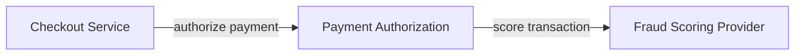

# Agentic Canvas — Flow Plugin Specification

**Canvas name:** `flow`  
**Target project:** `@trohde/agentic-canvas`  
**Status:** Proposed implementation specification  
**Created:** 2026-06-15  
**Primary outcome:** Add a structured graph/workflow canvas for precise agent-manipulated models.

---

## 1. Executive summary

The `flow` plugin adds a typed node/edge graph canvas to Agentic Canvas. It is intended for architecture maps, application dependency graphs, workflow models, data lineage, integration flows, control/risk flows, and other structured diagrams where the graph itself is the primary artifact.

Excalidraw remains the informal sketch canvas. JSON Canvas should become the portable knowledge-card canvas. `flow` becomes the precise model canvas.

The MVP should allow an MCP client to:

1. create typed nodes;
2. add typed ports/handles to nodes;
3. connect nodes with typed edges;
4. query upstream/downstream dependencies;
5. find paths and cycles;
6. validate graph integrity;
7. auto-layout the graph;
8. save/open a local graph file;
9. render and edit the graph live in the browser.

This plugin should be stricter than Excalidraw and JSON Canvas. It should reject invalid structures instead of silently drawing ambiguous diagrams.

---

## 2. Source basis

This spec is based on:

- React Flow / xyflow documentation: https://reactflow.dev/
- React Flow package usage: `@xyflow/react`
- React Flow concepts: nodes connected by edges, handles/ports, controlled node and edge state, custom node and edge rendering.
- Current Agentic Canvas project shape: local-first Node process, MCP over HTTP, WebSocket browser sync, plugin interface, Excalidraw as the first plugin.

Important React Flow facts used here:

- The current React package is `@xyflow/react`.
- `<ReactFlow />` renders nodes and edges and supports controlled state.
- Handles are attachment points where edges connect to nodes.
- Edges have source and target nodes and may reference specific handles.
- React Flow includes built-in interaction behavior such as dragging, connecting, selecting, zooming, and panning.

---

## 3. Product goal

Add a canvas that lets agents create and reason over explicit graph models.

Typical use cases:

- system architecture maps;
- service dependency diagrams;
- application integration flows;
- data lineage;
- event-driven architecture maps;
- workflow and process models;
- control/risk relationship maps;
- capability-to-system mappings;
- target-state migration plans;
- incident blast-radius analysis.

Example prompt the plugin should support:

> “Create a flow map of the payment authorization path, identify upstream dependencies, and flag cycle or single-point-of-failure risks.”

Expected result: a typed graph with systems, queues, databases, external parties, ports, labeled edges, validation findings, and a layout that a human can inspect.

---

## 4. Design principles

### 4.1 Graph-first, not drawing-first

Every visual element should have graph semantics. A node is a node. An edge is a relationship. Ports are explicit connection points. Metadata is first-class.

Do not model important semantics as freeform labels in a shape.

### 4.2 Validation over permissiveness

The plugin should prevent invalid graph states where possible and report them clearly when loaded from files.

Examples:

- edge points to missing node;
- edge points to missing handle;
- duplicate ID;
- unsupported node type;
- relationship type not allowed between source and target types;
- cycle exists in a graph declared as acyclic.

### 4.3 Stable file format

Use a simple Agentic Canvas-owned JSON file format in the MVP. Do not depend on React Flow’s internal serialization as the durable contract.

React Flow is the browser renderer. The `flow` file format is the plugin’s semantic model.

### 4.4 Agent-friendly operations

Prioritize tools that operate at graph level:

- add node;
- connect nodes;
- add port;
- find path;
- find cycles;
- find upstream/downstream;
- validate;
- layout;
- bulk patch.

Do not force agents to manipulate pixel-level geometry unless they explicitly need to.

---

## 5. Relationship to Excalidraw and JSON Canvas

| Concern | Excalidraw | JSON Canvas | Flow |
|---|---|---|---|
| Primary mode | Sketch | Knowledge cards | Typed graph model |
| Main objects | Shapes, text, arrows | Cards, groups, edges | Nodes, ports, typed edges |
| Best for | Communication | Research / knowledge maps | Architecture / workflow reasoning |
| File format | `.excalidraw` | `.canvas` | `.flow.json` |
| Validation | Low | Medium | High |
| Agent reasoning | Visual-object level | Semantic-card level | Graph-query level |

Use `flow` when the graph structure matters more than the drawing.

---

## 6. Non-goals

The MVP must not include:

- BPMN compliance;
- ArchiMate compliance;
- C4 model enforcement;
- UML import/export;
- Mermaid import parser;
- graph database storage;
- live runtime monitoring;
- cloud collaboration;
- simulation engine;
- executable workflows;
- code generation;
- multi-user CRDT editing;
- policy engine integration.

Those can be future features. The MVP should stay a local-first typed graph editor controlled by MCP.

---

## 7. Required project refactor before implementation

Like the JSON Canvas plugin, `flow` requires the core Agentic Canvas runtime to become plugin-neutral.

### 7.1 Remove Excalidraw-specific assumptions from core

Refactor away from:

- `Scene.elements: ExcalidrawElement[]`
- `CanvasObject.raw: ExcalidrawElement`
- `SerializedScene.type: "excalidraw"`
- hardcoded CLI validation for `excalidraw`
- server direct construction of the Excalidraw plugin
- browser app assuming one Excalidraw renderer

### 7.2 Generic scene wrapper

```ts
export interface Scene<TNative = unknown, TAppState = Record<string, unknown>> {
  native: TNative;
  appState: TAppState;
  version: number;
}
```

For Flow:

```ts
export type FlowScene = Scene<FlowDocument, FlowAppState>;
```

### 7.3 Static plugin registry

```ts
export const canvasPlugins = {
  excalidraw: createExcalidrawPlugin,
  jsoncanvas: createJsonCanvasPlugin,
  flow: createFlowPlugin,
} satisfies Record<string, () => CanvasPlugin>;
```

### 7.4 Browser renderer selection

The web app should render based on server-selected canvas:

```tsx
switch (canvasInfo.canvas) {
  case "excalidraw":
    return <ExcalidrawCanvasApp />;
  case "jsoncanvas":
    return <JsonCanvasApp />;
  case "flow":
    return <FlowCanvasApp />;
}
```

---

## 8. File and directory layout

```text
src/plugins/flow/
  index.ts              # CanvasPlugin implementation
  model.ts              # Flow document types
  schemas.ts            # Zod schemas for file format and MCP inputs
  format.ts             # serialize/deserialize .flow.json
  adapter.ts            # flow graph <-> CanvasObject summary/object
  tools.ts              # Flow-specific MCP tools
  graph.ts              # graph traversal algorithms
  validation.ts         # graph validation rules
  layout.ts             # deterministic layout
  mermaid.ts            # export Mermaid flowchart text, future import later
  defaults.ts           # node types, edge types, size defaults

src/web/canvases/flow/
  FlowCanvasApp.tsx     # React Flow renderer + WS integration
  nodes/
    SystemNode.tsx
    ServiceNode.tsx
    DatabaseNode.tsx
    QueueNode.tsx
    ExternalNode.tsx
    DecisionNode.tsx
    NoteNode.tsx
    BoundaryNode.tsx
  edges/
    TypedEdge.tsx
  inspector/
    NodeInspector.tsx
    EdgeInspector.tsx
  mapping.ts            # FlowDocument <-> React Flow nodes/edges

tests/flow/
  flow-format.test.ts
  flow-validation.test.ts
  flow-adapter.test.ts
  flow-graph.test.ts
  flow-layout.test.ts
  flow-tools.test.ts
  flow-mermaid.test.ts
  flow-ws-roundtrip.test.ts
```

---

## 9. Dependencies

### 9.1 Required runtime dependency

```bash
npm install @xyflow/react
```

Use React Flow as the browser renderer for `flow`.

### 9.2 Optional future dependencies

Do not add these in the MVP unless deterministic layout becomes too weak:

- `elkjs` for advanced layered graph layout;
- `dagre` for simpler DAG layout;
- a Mermaid parser for import.

MVP layout should be plain TypeScript and deterministic.

---

## 10. File format

Use `.flow.json` in the MVP.

Rationale:

- clear ownership by Agentic Canvas;
- plain JSON;
- easy to diff;
- easy for MCP clients to inspect;
- avoids pretending to be a formal standard such as BPMN, ArchiMate, or Mermaid.

### 10.1 Top-level document

```ts
export interface FlowDocument {
  type: "agentic-flow";
  version: 1;
  nodes: FlowNode[];
  edges: FlowEdge[];
  settings?: FlowSettings;
}
```

### 10.2 Settings

```ts
export interface FlowSettings {
  direction?: "LR" | "TB";
  acyclic?: boolean;
  allowedEdgeTypes?: string[];
  domain?: "architecture" | "workflow" | "data-lineage" | "risk-control" | "generic";
}
```

---

## 11. Native graph model

### 11.1 Node model

```ts
export type FlowNodeType =
  | "system"
  | "service"
  | "database"
  | "queue"
  | "topic"
  | "external"
  | "actor"
  | "process"
  | "decision"
  | "control"
  | "risk"
  | "boundary"
  | "note"
  | "generic";

export type FlowNodeStatus =
  | "unknown"
  | "proposed"
  | "active"
  | "deprecated"
  | "retired"
  | "at-risk";

export interface FlowNode {
  id: string;
  type: FlowNodeType;
  label: string;
  description?: string;
  x: number;
  y: number;
  width?: number;
  height?: number;
  status?: FlowNodeStatus;
  owner?: string;
  system?: string;
  tags?: string[];
  ports?: FlowPort[];
  parentId?: string;
  metadata?: Record<string, unknown>;
}
```

### 11.2 Port model

```ts
export type FlowPortDirection = "in" | "out" | "both";
export type FlowPortSide = "top" | "right" | "bottom" | "left";

export interface FlowPort {
  id: string;
  label?: string;
  direction: FlowPortDirection;
  side: FlowPortSide;
  protocol?: string;
  dataType?: string;
  required?: boolean;
  metadata?: Record<string, unknown>;
}
```

### 11.3 Edge model

```ts
export type FlowEdgeType =
  | "depends_on"
  | "calls"
  | "publishes"
  | "subscribes"
  | "reads"
  | "writes"
  | "sends_to"
  | "receives_from"
  | "contains"
  | "controls"
  | "mitigates"
  | "causes"
  | "sequence"
  | "fallback"
  | "generic";

export interface FlowEdge {
  id: string;
  type: FlowEdgeType;
  source: string;
  target: string;
  sourcePort?: string;
  targetPort?: string;
  label?: string;
  description?: string;
  status?: "unknown" | "proposed" | "active" | "deprecated";
  direction?: "directed" | "bidirectional";
  tags?: string[];
  metadata?: Record<string, unknown>;
}
```

### 11.4 Runtime app state

Do not write volatile UI state into `.flow.json` unless explicitly requested later.

```ts
export interface FlowAppState {
  viewport?: {
    x: number;
    y: number;
    zoom: number;
  };
  selectedIds?: string[];
  lastSavedPath?: string;
  inspectorOpen?: boolean;
}
```

---

## 12. Default node sizes

```ts
export const FLOW_NODE_DEFAULTS: Record<FlowNodeType, { width: number; height: number }> = {
  system: { width: 220, height: 100 },
  service: { width: 220, height: 90 },
  database: { width: 200, height: 90 },
  queue: { width: 200, height: 80 },
  topic: { width: 200, height: 80 },
  external: { width: 220, height: 100 },
  actor: { width: 180, height: 80 },
  process: { width: 220, height: 90 },
  decision: { width: 180, height: 120 },
  control: { width: 220, height: 90 },
  risk: { width: 220, height: 90 },
  boundary: { width: 520, height: 360 },
  note: { width: 260, height: 140 },
  generic: { width: 220, height: 90 },
};
```

---

## 13. ID strategy

Use stable IDs with semantic prefixes.

```ts
function createFlowId(prefix: "node" | "edge" | "port"): string {
  return `${prefix}_${crypto.randomUUID().slice(0, 8)}`;
}
```

Rules:

- Preserve IDs across save/open.
- Do not derive IDs from labels.
- Ensure edge IDs are stable and not recalculated from endpoints.
- Reject duplicate IDs unless repair mode is explicitly requested.

---

## 14. Serialization and file handling

### 14.1 Save behavior

For `--canvas flow`, `save_canvas` should append `.flow.json` when no extension is provided.

Example:

```json
{ "path": "payments-authorization" }
```

Writes:

```text
payments-authorization.flow.json
```

Reject other extensions in MVP.

### 14.2 Open behavior

For `--canvas flow`, `open_canvas` accepts `.flow.json` only.

Validation:

- parse JSON;
- validate top-level `type: "agentic-flow"`;
- validate `version: 1`;
- validate node and edge arrays;
- reject duplicates;
- reject dangling edges;
- reject missing ports if an edge references them;
- validate allowed node/edge/status values;
- validate dimensions and coordinates;
- run graph-level validation.

### 14.3 Example `.flow.json`

```json
{
  "type": "agentic-flow",
  "version": 1,
  "settings": {
    "direction": "LR",
    "acyclic": true,
    "domain": "architecture"
  },
  "nodes": [
    {
      "id": "node_checkout",
      "type": "service",
      "label": "Checkout Service",
      "description": "Starts the payment authorization flow.",
      "x": 0,
      "y": 0,
      "status": "active",
      "ports": [
        { "id": "out_auth", "label": "authorize", "direction": "out", "side": "right", "protocol": "HTTPS" }
      ]
    },
    {
      "id": "node_auth",
      "type": "service",
      "label": "Payment Authorization",
      "x": 360,
      "y": 0,
      "status": "active",
      "ports": [
        { "id": "in_auth", "direction": "in", "side": "left", "protocol": "HTTPS" },
        { "id": "out_fraud", "direction": "out", "side": "right", "protocol": "HTTPS" }
      ]
    },
    {
      "id": "node_fraud",
      "type": "external",
      "label": "Fraud Scoring Provider",
      "x": 720,
      "y": 0,
      "status": "at-risk"
    }
  ],
  "edges": [
    {
      "id": "edge_checkout_auth",
      "type": "calls",
      "source": "node_checkout",
      "sourcePort": "out_auth",
      "target": "node_auth",
      "targetPort": "in_auth",
      "label": "authorize payment"
    },
    {
      "id": "edge_auth_fraud",
      "type": "calls",
      "source": "node_auth",
      "sourcePort": "out_fraud",
      "target": "node_fraud",
      "label": "score transaction"
    }
  ]
}
```

---

## 15. React Flow browser mapping

### 15.1 Flow node to React Flow node

```ts
function toReactFlowNode(node: FlowNode): Node<FlowNode> {
  return {
    id: node.id,
    type: node.type,
    position: { x: node.x, y: node.y },
    parentId: node.parentId,
    data: node,
    width: node.width,
    height: node.height,
    style: {
      width: node.width ?? FLOW_NODE_DEFAULTS[node.type].width,
      height: node.height ?? FLOW_NODE_DEFAULTS[node.type].height,
    },
    draggable: true,
    selectable: true,
  };
}
```

### 15.2 Flow edge to React Flow edge

```ts
function toReactFlowEdge(edge: FlowEdge): Edge<FlowEdge> {
  return {
    id: edge.id,
    type: "typed",
    source: edge.source,
    target: edge.target,
    sourceHandle: edge.sourcePort,
    targetHandle: edge.targetPort,
    label: edge.label ?? edge.type,
    data: edge,
    animated: edge.status === "proposed",
  };
}
```

### 15.3 React Flow changes back to Flow document

Browser change handling must update only the semantic model:

- node drag updates `x` and `y`;
- node resize updates `width` and `height`;
- node label edit updates `label`;
- edge connect creates `FlowEdge`;
- edge reconnect updates `source`, `target`, `sourcePort`, `targetPort`;
- delete removes nodes/edges and cleans dangling edges.

React Flow-only view state should not leak into the saved file.

---

## 16. Node UI requirements

### 16.1 Common node surface

Each node should show:

- label;
- type badge;
- status indicator;
- optional short description;
- optional tags;
- visible ports/handles when selected or hovered.

### 16.2 Node-specific rendering

MVP can keep rendering simple but distinguish types visually by icon/shape/text:

| Type | Rendering intent |
|---|---|
| `system` | larger container-like system card |
| `service` | standard service card |
| `database` | database icon/header |
| `queue` / `topic` | event/messaging card |
| `external` | external boundary indicator |
| `actor` | human/system actor card |
| `process` | workflow step |
| `decision` | diamond-like card or decision header |
| `control` | control/check card |
| `risk` | risk warning card |
| `boundary` | large group/container |
| `note` | annotation card |
| `generic` | plain fallback card |

Keep CSS local and minimal. Avoid a design-system dependency.

---

## 17. MCP tools

### 17.1 Baseline tools expected to work

- `get_canvas_state`
- `list_objects`
- `get_object`
- `delete_object` / `delete_objects`
- `clear_canvas`
- `save_canvas`
- `open_canvas`
- `screenshot`
- `get_selected_objects`
- `select_objects`

For `flow`, `list_objects` should include nodes, edges, and optionally ports when requested.

### 17.2 `add_flow_node`

Creates a typed node.

Input:

```ts
{
  type: FlowNodeType;
  label: string;
  description?: string;
  x?: number;
  y?: number;
  width?: number;
  height?: number;
  status?: FlowNodeStatus;
  owner?: string;
  system?: string;
  tags?: string[];
  parentId?: string;
  ports?: FlowPort[];
  metadata?: Record<string, unknown>;
}
```

Rules:

- `type` and `label` are required.
- Omitted coordinates use deterministic free placement.
- Default size depends on node type.
- `parentId` must reference a `boundary` node unless future rules allow other parents.

### 17.3 `add_port`

Adds a port/handle to an existing node.

Input:

```ts
{
  nodeId: string;
  id?: string;
  label?: string;
  direction: "in" | "out" | "both";
  side: "top" | "right" | "bottom" | "left";
  protocol?: string;
  dataType?: string;
  required?: boolean;
  metadata?: Record<string, unknown>;
}
```

Rules:

- Node must exist.
- Port ID must be unique within the node.
- Use `port_<shortid>` if omitted.

### 17.4 `connect_flow_nodes`

Creates a typed edge.

Input:

```ts
{
  source: string;
  target: string;
  type?: FlowEdgeType;
  sourcePort?: string;
  targetPort?: string;
  label?: string;
  description?: string;
  status?: "unknown" | "proposed" | "active" | "deprecated";
  direction?: "directed" | "bidirectional";
  tags?: string[];
  metadata?: Record<string, unknown>;
}
```

Rules:

- Source and target nodes must exist.
- Source and target ports must exist if provided.
- If source port direction is `in`, reject unless direction is `both`.
- If target port direction is `out`, reject unless direction is `both`.
- Default edge type is `generic`.

### 17.5 `update_flow_node`

Input:

```ts
{
  id: string;
  type?: FlowNodeType;
  label?: string;
  description?: string | null;
  x?: number;
  y?: number;
  width?: number;
  height?: number;
  status?: FlowNodeStatus;
  owner?: string | null;
  system?: string | null;
  tags?: string[];
  parentId?: string | null;
  metadata?: Record<string, unknown> | null;
}
```

Rules:

- `null` removes optional fields.
- Changing type must keep existing ports unless explicitly replaced.
- Reject parent cycles.

### 17.6 `update_flow_edge`

Input:

```ts
{
  id: string;
  type?: FlowEdgeType;
  source?: string;
  target?: string;
  sourcePort?: string | null;
  targetPort?: string | null;
  label?: string | null;
  description?: string | null;
  status?: "unknown" | "proposed" | "active" | "deprecated";
  direction?: "directed" | "bidirectional";
  tags?: string[];
  metadata?: Record<string, unknown> | null;
}
```

### 17.7 `find_flow_nodes`

Input:

```ts
{
  query?: string;
  type?: FlowNodeType;
  status?: FlowNodeStatus;
  owner?: string;
  system?: string;
  tag?: string;
  parentId?: string;
  limit?: number;
}
```

Searches label, description, owner, system, tags, and metadata string values.

### 17.8 `find_flow_edges`

Input:

```ts
{
  query?: string;
  type?: FlowEdgeType;
  source?: string;
  target?: string;
  touchingNode?: string;
  tag?: string;
  limit?: number;
}
```

### 17.9 `find_upstream`

Input:

```ts
{
  nodeId: string;
  depth?: number;
  edgeTypes?: FlowEdgeType[];
  includeEdges?: boolean;
}
```

Returns nodes that can reach `nodeId` by following incoming edges.

### 17.10 `find_downstream`

Input:

```ts
{
  nodeId: string;
  depth?: number;
  edgeTypes?: FlowEdgeType[];
  includeEdges?: boolean;
}
```

Returns nodes reachable from `nodeId` by following outgoing edges.

### 17.11 `find_paths`

Input:

```ts
{
  from: string;
  to: string;
  maxDepth?: number;
  edgeTypes?: FlowEdgeType[];
  limit?: number;
}
```

Returns simple paths from source to target.

Rules:

- Default `maxDepth` is 8.
- Default `limit` is 20.
- Avoid exponential blowups with hard caps.

### 17.12 `find_cycles`

Input:

```ts
{
  edgeTypes?: FlowEdgeType[];
  limit?: number;
}
```

Returns cycles as ordered node ID arrays.

### 17.13 `validate_flow`

Input:

```ts
{
  mode?: "basic" | "strict";
  domainRules?: boolean;
}
```

Output:

```ts
{
  valid: boolean;
  errors: FlowValidationIssue[];
  warnings: FlowValidationIssue[];
  stats: {
    nodeCount: number;
    edgeCount: number;
    orphanNodeCount: number;
    cycleCount: number;
  };
}
```

### 17.14 `auto_layout_flow`

Input:

```ts
{
  direction?: "LR" | "TB";
  layerSpacing?: number;
  nodeSpacing?: number;
  preserveManualGroups?: boolean;
  includeOrphans?: boolean;
}
```

Rules:

- Deterministic.
- Layer by graph topology where possible.
- Keep boundary children inside parent bounds.
- Place orphan nodes in a separate area.
- Return old/new bounds.

### 17.15 `export_mermaid`

Exports a Mermaid flowchart as text.

Input:

```ts
{
  direction?: "LR" | "TB";
  includeDescriptions?: boolean;
}
```

Output:

```ts
{
  format: "mermaid";
  text: string;
}
```

Example output:



Do not implement Mermaid import in MVP unless it is trivial and well-tested.

### 17.16 `apply_flow_patch`

Atomic bulk patch for agents.

Input:

```ts
{
  createNodes?: FlowNode[];
  updateNodes?: Array<{ id: string; patch: Partial<FlowNode> }>;
  deleteNodeIds?: string[];
  createEdges?: FlowEdge[];
  updateEdges?: Array<{ id: string; patch: Partial<FlowEdge> }>;
  deleteEdgeIds?: string[];
  addPorts?: Array<{ nodeId: string; port: FlowPort }>;
  deletePorts?: Array<{ nodeId: string; portId: string }>;
  repair?: boolean;
}
```

Rules:

- Apply all-or-nothing inside `controller.transaction`.
- Validate final graph before committing.
- Return created, updated, deleted IDs and validation summary.

This is the preferred tool for large agent-generated graphs.

---

## 18. Graph algorithms

Implement graph algorithms in Node-side plugin code, not browser UI.

### 18.1 Adjacency index

```ts
export interface FlowGraphIndex {
  nodesById: Map<string, FlowNode>;
  edgesById: Map<string, FlowEdge>;
  outgoing: Map<string, FlowEdge[]>;
  incoming: Map<string, FlowEdge[]>;
}
```

Build this index on demand from the current scene.

### 18.2 Upstream/downstream

Use breadth-first traversal with:

- depth cap;
- edge type filter;
- visited set;
- stable sorted output.

### 18.3 Path finding

Use bounded DFS for simple paths.

Rules:

- no repeated nodes in one path;
- configurable max depth;
- configurable result limit;
- stable edge order by label/type/id.

### 18.4 Cycle detection

Use DFS with recursion stack or Tarjan SCC.

MVP can use DFS and return representative cycles. Full cycle enumeration can explode; cap results.

---

## 19. Validation rules

### 19.1 Basic validation

Errors:

- duplicate node ID;
- duplicate edge ID;
- edge missing source node;
- edge missing target node;
- edge source port missing;
- edge target port missing;
- invalid node type;
- invalid edge type;
- invalid status;
- invalid coordinates;
- invalid dimensions;
- parent node missing;
- parent cycle.

Warnings:

- orphan node;
- node has no label;
- edge has no label;
- deprecated node has active incoming dependencies;
- at-risk node has many downstream dependents;
- boundary node has no children.

### 19.2 Strict validation

Additional warnings/errors:

- graph is cyclic while `settings.acyclic === true`;
- external node has incoming `writes` edge;
- database has outgoing `calls` edge;
- queue/topic has synchronous `calls` edge;
- `risk` node has no `mitigates` or `causes` edge;
- `control` node has no `mitigates` or `controls` edge.

Keep strict rules configurable. Do not hardcode bank- or architecture-specific semantics into the default mode.

---

## 20. Layout algorithm

MVP deterministic layout:

1. Build directed graph using all edges except `contains`.
2. Identify roots: nodes with no incoming edges.
3. If no roots exist because graph is cyclic, pick stable roots by node type priority and ID.
4. Assign layers using longest path from roots.
5. Break cycles for layout only by ignoring back edges detected during traversal.
6. Sort nodes within each layer by type priority, then label, then ID.
7. Place layers left-to-right (`LR`) or top-to-bottom (`TB`).
8. Place orphan nodes in a separate row/column.
9. Expand boundary nodes around children.
10. Preserve manually positioned boundary nodes when `preserveManualGroups` is true.

Suggested defaults:

```ts
const LAYOUT_DEFAULTS = {
  layerSpacing: 360,
  nodeSpacing: 120,
  orphanSpacing: 80,
  boundaryPadding: 80,
};
```

---

## 21. Browser UI behavior

### 21.1 Required interactions

- drag nodes;
- resize nodes;
- connect nodes via handles;
- reconnect edges;
- select nodes and edges;
- multi-select;
- delete selected items;
- edit label and description;
- edit edge label/type;
- add/remove ports from inspector;
- fit view;
- zoom/pan;
- screenshot.

### 21.2 Inspector panel

Add a small inspector panel for selected node/edge.

Node inspector fields:

- label;
- type;
- status;
- description;
- owner;
- system;
- tags;
- ports.

Edge inspector fields:

- label;
- type;
- status;
- source;
- target;
- source port;
- target port;
- description;
- tags.

### 21.3 Keyboard shortcuts

MVP:

- `Delete` / `Backspace`: delete selected elements;
- `Cmd/Ctrl+A`: select all;
- `Esc`: clear selection;
- `F`: fit view.

Do not overbuild shortcut customization in MVP.

---

## 22. WebSocket protocol

Use a plugin-neutral scene protocol.

Server to browser:

```ts
{
  type: "scene:set";
  canvas: "flow";
  version: number;
  scene: FlowDocument;
  appState?: FlowAppState;
  origin?: string;
}
```

Browser to server:

```ts
{
  type: "scene:changed";
  canvas: "flow";
  version?: number;
  scene: FlowDocument;
  appState?: FlowAppState;
  origin?: string;
}
```

Rules:

- Server remains authoritative.
- Browser sends full document in MVP.
- Server validates browser changes before accepting.
- Invalid browser changes are rejected and current server scene is re-broadcast.
- Full-scene sync is acceptable for MVP, matching the current project posture.

---

## 23. Security and workspace behavior

Rules:

- `.flow.json` open/save paths must stay inside workspace root.
- Metadata is inert JSON only.
- Do not evaluate expressions in metadata.
- Do not fetch remote resources.
- Do not execute generated Mermaid.
- Screenshots write only through workspace-safe path handling.

---

## 24. Mapping to Agentic Canvas objects

### 24.1 Generic summary

Use plugin-native summaries rather than shape-only summaries.

```ts
export interface CanvasObjectSummary {
  id: string;
  pluginType: string;       // e.g. "flow.service", "flow.calls"
  kind: "node" | "edge" | "port" | "group" | "shape" | "text";
  x?: number;
  y?: number;
  width?: number;
  height?: number;
  label?: string;
  text?: string;
}
```

### 24.2 Flow mapping

| Flow item | `pluginType` | `kind` | Summary label |
|---|---|---|---|
| node | `flow.<nodeType>` | `node` | node label |
| boundary node | `flow.boundary` | `group` | boundary label |
| edge | `flow.<edgeType>` | `edge` | edge label or type |
| port | `flow.port` | `port` | port label/id |

### 24.3 Full object

```ts
export interface FlowCanvasObject extends CanvasObjectSummary {
  raw: FlowNode | FlowEdge | FlowPort;
  references?: {
    incomingEdgeIds?: string[];
    outgoingEdgeIds?: string[];
    sourceNodeId?: string;
    targetNodeId?: string;
    parentId?: string;
    childNodeIds?: string[];
  };
}
```

---

## 25. Testing plan

### 25.1 Unit tests

`flow-format.test.ts`

- serializes document to stable pretty JSON;
- appends `.flow.json`;
- rejects wrong extension;
- opens valid fixture;
- rejects invalid top-level type/version.

`flow-validation.test.ts`

- duplicate IDs rejected;
- dangling edges rejected;
- missing ports rejected;
- parent cycles rejected;
- acyclic setting reports cycles;
- strict rules produce expected warnings.

`flow-graph.test.ts`

- upstream traversal;
- downstream traversal;
- bounded path finding;
- cycle detection;
- edge type filtering;
- deterministic output ordering.

`flow-layout.test.ts`

- deterministic layout;
- roots in first layer;
- cycles handled without infinite loop;
- orphan placement;
- boundary expansion.

`flow-tools.test.ts`

- `add_flow_node` creates valid node;
- `add_port` creates valid port;
- `connect_flow_nodes` validates endpoints;
- `find_paths` returns expected paths;
- `apply_flow_patch` is atomic;
- failed patch does not mutate scene.

`flow-mermaid.test.ts`

- exports simple graph;
- escapes labels safely;
- supports LR/TB directions;
- handles duplicate-looking labels via stable IDs.

### 25.2 Integration tests

- MCP in-memory transport calls all plugin tools.
- `save_canvas` + `open_canvas` round trip preserves document.
- Browser drag updates server `x`/`y`.
- Browser edge creation updates server edge list.
- Invalid browser edge is rejected and scene is restored.
- Selection and screenshot work.

### 25.3 Fixture tests

```text
tests/fixtures/flow/
  minimal.flow.json
  architecture-basic.flow.json
  cyclic.flow.json
  ports.flow.json
  risk-control.flow.json
```

---

## 26. Documentation changes

Update README:

```md
npm start -- --canvas flow
npx @trohde/agentic-canvas --canvas flow
```

Update flags:

```md
--canvas <name>: canvas plugin, one of `excalidraw`, `jsoncanvas`, `flow`
```

Add example MCP flow:

```md
1. Call `add_flow_node` for services, databases, queues, and external dependencies.
2. Call `add_port` for important integration points.
3. Call `connect_flow_nodes` with relationship types like `calls`, `publishes`, `reads`, and `writes`.
4. Call `validate_flow` to find dangling edges, cycles, and orphan nodes.
5. Call `find_downstream` to assess blast radius.
6. Call `auto_layout_flow`.
7. Call `save_canvas` with `{ "path": "payments-authorization" }`.
```

Known limitation:

```md
The Flow plugin is an Agentic Canvas-native graph format. It exports Mermaid flowchart text, but it is not BPMN, ArchiMate, UML, or C4 compliant in v1.
```

---

## 27. Implementation milestones

### Milestone 0 — plugin-neutral core

- Add plugin registry.
- Generalize scene wrapper.
- Generalize serialized scene.
- Generalize WS scene payload.
- Generalize browser renderer selection.
- Keep Excalidraw default behavior unchanged.

Acceptance:

```bash
npm run verify
npm start -- --canvas excalidraw
```

### Milestone 1 — Flow model and validation

- Add `model.ts`.
- Add Zod schemas.
- Add validation rules.
- Add fixtures.
- Add format open/save.

Acceptance:

```bash
npm test -- flow-format flow-validation
```

### Milestone 2 — graph algorithms

- Add graph index.
- Add upstream/downstream.
- Add path finding.
- Add cycle detection.
- Add deterministic layout.

Acceptance:

```bash
npm test -- flow-graph flow-layout
```

### Milestone 3 — MCP tools

- Add node, port, edge tools.
- Add search tools.
- Add validation tool.
- Add layout tool.
- Add `apply_flow_patch`.
- Add Mermaid export.

Acceptance:

- Agent can create a 15-node architecture graph in one patch.
- `validate_flow` returns useful warnings.
- `find_downstream` returns expected blast radius.

### Milestone 4 — browser renderer

- Add `FlowCanvasApp.tsx`.
- Add React Flow node/edge mapping.
- Add custom node components.
- Add typed edge component.
- Add inspector panel.
- Add browser-to-server updates.
- Add screenshot/selection support.

Acceptance:

- MCP-created graph appears live.
- Human-created edge appears in server state.
- Invalid edge is rejected.
- Drag/resize/edit round trips.

### Milestone 5 — docs and release

- README updates.
- Manual verification checklist.
- Changelog.
- Package smoke test.

---

## 28. Manual verification checklist

1. Run:

   ```bash
   npm run build && npm start -- --canvas flow --workspace /tmp/agentic-canvas-flow
   ```

2. Connect MCP client.
3. Call `add_flow_node` for three services and one database.
4. Call `add_port` on at least two nodes.
5. Call `connect_flow_nodes` with `calls` and `writes` edges.
6. Confirm graph appears live in browser.
7. Drag a node in browser.
8. Call `get_object` and confirm updated `x`/`y`.
9. Create an edge in browser.
10. Call `list_objects` and confirm the edge exists.
11. Call `validate_flow` and inspect warnings.
12. Call `find_downstream` from the first service.
13. Call `find_paths` between first service and database.
14. Call `auto_layout_flow`.
15. Call `export_mermaid`.
16. Call `save_canvas` with `{ "path": "demo" }`.
17. Confirm `demo.flow.json` exists.
18. Call `clear_canvas`.
19. Call `open_canvas` with `{ "path": "demo" }`.
20. Confirm graph restores.
21. Call `screenshot` and confirm PNG is returned.

---

## 29. Acceptance criteria

The plugin is ready when:

- `npm run verify` passes;
- `--canvas flow` starts successfully;
- baseline MCP tools work;
- Flow-specific MCP tools work;
- `.flow.json` files round-trip;
- graph validation catches core invalid states;
- graph traversal tools work;
- browser edits sync to server;
- server edits sync to browser;
- screenshot works;
- selection works;
- Mermaid export works;
- README documents usage;
- Excalidraw remains unaffected.

---

## 30. Risks and mitigations

| Risk | Impact | Mitigation |
|---|---:|---|
| Flow becomes an unofficial ArchiMate/BPMN clone | Scope explosion | Keep domain generic in MVP |
| React Flow internal state leaks into file format | Fragile persistence | Own `.flow.json` schema |
| Graph validation too strict | User friction | Provide `basic` and `strict` modes |
| Path finding explodes on dense graphs | Slow tool calls | Depth and result caps |
| Auto-layout moves carefully placed diagrams | User frustration | Run layout only by explicit tool call |
| Core remains Excalidraw-specific | Plugin blocked | Complete Milestone 0 first |
| Too many node/edge types confuse agents | Poor results | Provide good defaults and examples |

---

## 31. Future enhancements

After MVP:

- import Mermaid flowcharts;
- export SVG directly from browser;
- optional ELK/Dagre layout;
- architecture-specific profile;
- workflow-specific profile;
- risk/control profile;
- C4-style node presets;
- data lineage profile;
- impact analysis report generation;
- compare two flow files;
- detect architectural anti-patterns;
- convert JSON Canvas cards into Flow nodes;
- convert Flow graph into Excalidraw presentation diagram;
- graph metrics: degree, centrality, orphan rate, fan-in/fan-out;
- policy checks via configurable rules.

---

## 32. Recommended first implementation ticket

**Ticket:** Add plugin-neutral core and shared React Flow renderer foundation.

Scope:

- plugin registry;
- plugin-neutral scene and WS payload;
- browser renderer selection;
- add `@xyflow/react` dependency;
- create shared `src/web/canvases/graph/` helpers reusable by both `jsoncanvas` and `flow`;
- keep Excalidraw default and tests green.

This reduces duplicate work because both `jsoncanvas` and `flow` can use React Flow for browser rendering while keeping separate file formats and MCP tools.
